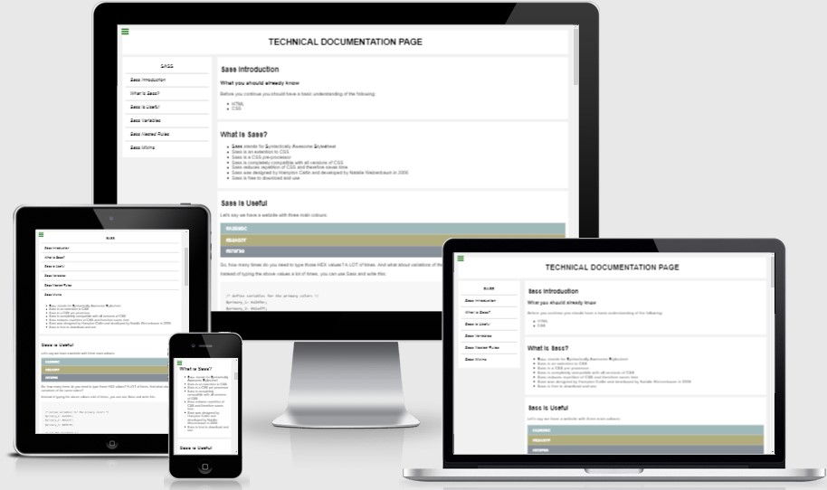

# Technical Documentation Page

This is a freeCodeCamp Responsive Web Design Project.

The overall aim was to acheive a Technical Documentation page, this was only focusing on using HTML, CSS and SASS to help me develop my front end skills further!

## Showcase

 

A deployed version of my website can be found [here](https://elliej87.github.io/TechnicalDocumentation/)

This domain will allow you to access the Tribute Page website.

## Table of Contents

1. [User Experience UX](#userexperienceuX)

    * [User Stories](#userstories)

        - [User Story #1](#userstory_1)
        - [User Story #2](#userstory_2)
        - [User Story #3](#userstory_3)
        - [User Story #4](#userstory_4)
        - [User Story #5](#userstory_5)
        - [User Story #6](#userstory_6)
        - [User Story #7](#userstory_7)
        - [User Story #8](#userstory_8)
        - [User Story #9](#userstory_9)
        - [User Story #10](#userstory_10)
        - [User Story #11](#userstory_11)
        - [User Story #12](#userstory_12)
        - [User Story #13](#userstory_13)
        - [User Story #14](#userstory_14)
        - [User Story #15](#userstory_15)
        - [Site Owner Goals](#sitegoals)

2. [Wireframes](#wireframesboards)

3. [Features](#featuressite)

    * [Navigation Bar](#navbar)
    * [Main Container](#maincontainer)
    * [Footer](#footerfeatures)

4. [Technologies Used](#technologies)

    * [Version Control](#versioncontrol)

5. [Functionality Testing](#functionalitytesting)
  
    - [Footer Social Navigation Links](#footerlinks)
      * [LinkedIn Icon](#linkedinicon)
      * [GitHub Icon](#githubicon)

6. [Responsive Design Testing](#responsivedesigntesting)

7. [Validation](#validationcode)
    - [HTML](#htmlcode)
    - [CSS](#csscode) 

8. [Deployment](#deploymentsite)

    * [Repository Link](#repositorylink)
    * [Running Code Locally](#runningcodelocally)

9. [Credits](#finalcredits)

    * [Content](#contentsite)
    * [Acknowledgments](#acknowledgmentsthanks)

## <a name="userexperienceuX">UX (User Experience)</a>

This website is for anyone who wants to get a brief insight to how to use SASS.

This website was to help practice my SCSS, HTML and CSS skills, This site has links to my social media sites where they can interact with me directly.

## <a name="userstories">User Stories</a>

### <a name="userstory_1">User Story #1</a>

- I can see a main element with a corresponding id="main-doc", which contains the page's main content (technical documentation).

### <a name="userstory_2">User Story #2</a>

- Within the #main-doc element, I can see several section elements, each with a class of main-section. There should be a minimum of 5.

### <a name="userstory_3">User Story #3</a>

- The first element within each .main-section should be a header element which contains text that describes the topic of that section.

### <a name="userstory_4">User Story #4</a>

- Each section element with the class of main-section should also have an id that corresponds with the text of each header contained within it. Any spaces should be replaced with underscores (e.g. The section that contains the header "JavaScript and Java" should have a corresponding id="JavaScript_and_Java").

### <a name="userstory_5">User Story #5</a>

- The .main-section elements should contain at least 10 p elements total (not each).

### <a name="userstory_6">User Story #6</a>

- The .main-section elements should contain at least 5 code elements total (not each).

### <a name="userstory_7">User Story #7</a>

- The .main-section elements should contain at least 5 li items total (not each).

### <a name="userstory_8">User Story #8</a>

- I can see a nav element with a corresponding id="navbar".

### <a name="userstory_9">User Story #9</a>

- The navbar element should contain one header element which contains text that describes the topic of the technical documentation.

### <a name="userstory_10">User Story #10</a>

- Additionally, the navbar should contain link (a) elements with the class of nav-link. There should be one for every element with the class main-section.

### <a name="userstory_11">User Story #11</a>

- The header element in the navbar must come before any link (a) elements in the navbar.

### <a name="userstory_12">User Story #12</a>

- Each element with the class of nav-link should contain text that corresponds to the header text within each section (e.g. if you have a "Hello world" section/header, your navbar should have an element which contains the text "Hello world").

### <a name="userstory_13">User Story #13</a>

- When I click on a navbar element, the page should navigate to the corresponding section of the main-doc element (e.g. If I click on a nav-link element that contains the text "Hello world", the page navigates to a section element that has that id and contains the corresponding header.

### <a name="userstory_14">User Story #14</a>

- On regular sized devices (laptops, desktops), the element with id="navbar" should be shown on the left side of the screen and should always be visible to the user.

### <a name="userstory_15">User Story #15</a>

- My Technical Documentation page should use at least one media query.

### <a name="sitegoals">Site Owner Goals</a>

- As a site owner I wanted to create and build a technical documentaion that holds key information regarding the program of SASS

## <a name="wireframesboards">Wireframes</a>

As this was a brief project no wireframes were designed prior to building this site.

## <a name="featuressite">Features</a>

This section is a brief highlight of features that this site contains.

### <a name="navbar">Navigation Bar</a>

- Is placed on the left had side is fixed when the user scrolls on larger screens
- On mobile this moves with the main body so it does not take up the width / height of the screen size
- All link navigations have a hover element
- navigation links are redirected to the correct section id

### <a name="maincontainer">Main Container</a>

- The main body is on the right hand side and is scrollable so the user can see the full content 
- Each section's container are styled in it's own element so this is easier for the user to identify the different section within the documentation
- Font is kept simple and clean so it is easy to read
- Colour palette is clean and minimalistic so there is no distraction on the main page

### <a name="footerfeatures">Footer</a>

- Contains the copyright text, this is on the left side of the page 
- Contains the ‘LinkedIn’ and ‘GitHub’ navigation links on the right side of the page and evenly spaced
- All navigation links have a colour change when the user hover over the icon, this is so the user knows they are interactive and have a purpose
- The ‘LinkedIn’ and ‘GitHub’ icons opens a new window to the relevant page 

## <a name="technologies">Technologies Used</a>

[CSS](https://en.wikipedia.org/wiki/CSS)

- The project uses CSS to apply the custom styles to create the look of my site.  The index.html file is linked directly to the main.css stylesheet

[Font Awesome](https://fontawesome.com/v4.7/) 

- The project uses Font Awesome icons for all navigation and social media links that feature in the header and footer of my site

Google Chrome Dev Tools

- For testing purposes for responsive design

[HTML5](https://en.wikipedia.org/wiki/HTML5)

- The project uses HTML to create the basic elements and content of my site 

[SASS](https://en.wikipedia.org/wiki/Sass_(stylesheet_language))

- The project uses SASS to apply the custom styles to create the look of my site.  The index.html file is linked directly to the main.css stylesheet

[Visual Studio Code](https://code.visualstudio.com)

- I used Visual Studio Code as the development environment to write the code for my website

### <a name="versioncontrol">Version Control</a>

[Git](https://git-scm.com)

-	I've used Git as a version control system to regularly add and commit changes made to project in Visual Studio Code, before pushing them to GitHub.

[GitHub](https://github.com)

-	I've used GitHub as a remote repository to push and store the committed changes to my project from Git. I've also used GitHub pages to deploy my website in a live environment.

## <a name="testingcases">Testing</a>

# <a name="functionalitytesting">Functionality Testing</a>

Browsers tested: Google Chrome, Mozilla Firefox & Opera.
The devices used in this testing include Samsung S10 v.Android 10.

## <a name="footerlinks">Footer Social Navigation Links</a>

### <a name="linkedinicon">LinkedIn Icon</a>

Expected: when hovering over 'LinkedIn' icon, the icon changes colour 
Testing: tested by hovering over item
Result: icon changes colour

Expected: when clicking on the ‘LinkedIn’ icon takes the user to my LinkedIn page
Testing: tested by clicking on the ‘LinkedIn’ icon
Results: link takes user to [LinkedIn](https://www.linkedin.com/in/ellie-judge-45b00689/)
 
### <a name="githubicon">GitHub Icon</a>

Expected: when hovering over 'GitHub' icon, the icon changes colour
Testing: tested by hovering over item
Result: icon changes colour

Expected: when clicking on the ‘GitHub’ icon takes the user to my GitHub repo page
Testing: tested by clicking on the ‘GitHub’ icon
Results: link takes user to [GitHub](https://github.com/EllieJ87)

## <a name="validationcode">Validation</a>

### <a name="htmlcode">HTML</a>

W3C testing completed for: index.html
No issues were stated.
 
## <a name="csscode">CSS</a>

W3C testing completed for: styles.css
No issues were stated.

## <a name="deploymentsite">Deployment</a>

The hosting platform that I've used for my project is GitHub Pages. To deploy my website to GitHub pages, I used the following steps:

-	Loaded the terminal window in my visual studio code workspace
-	Initialised Git using the Source Control in the control panel
-	Files that have been amended are automatically listed in the ‘Source Control’ panel
-	Add message in the ‘Message’ section, making sure the commits are clear and concise (re-checked previous commits for layout and what was fixed / still pending)
-	Click the ‘tick’ icon which stored the files in visual studio code
-	Click the ‘ellipsis’ icon and select the ‘push’ option
-	This then push all files and commits to the main branch
-	This will add the updated files into the ‘main branch’ option under the ‘GitHub pages’ section
-	Ran several commits after testing was carried out throughout my project.

### <a name="repositorylink">Repository Link</a>

[Technical Documentation Page](https://elliej87.github.io/TechnicalDocumentation/)

### <a name="runningcodelocally">Running Code Locally</a>

To run my code locally, users can download a local copy of my code to their desktop by completing the following steps:

-	Go to my GitHub repository.
-	Click on 'Clone or download'.
-	Click on 'Download ZIP'.
-	Once downloaded, extract the zip file's contents and run my website locally.

## <a name="contentsite">Content</a>

This website was a quick and fun site for me to practice more web development skills and styling .

Background image was styled and designed by me.

## <a name="acknowledgmentsthanks">Acknowledgments</a>

_**Created by Ellie Judge**_
